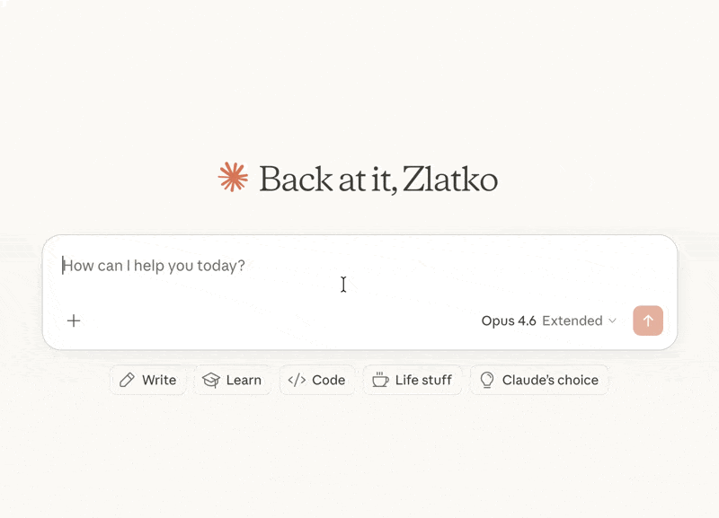

# youtube-summarize

MCP server that fetches YouTube video transcripts and optionally summarizes them.



## Features

- **Fetch transcripts** in multiple formats (text, JSON, SRT, WebVTT, pretty-print)
- **Video metadata** — title, description, channel, upload date, duration, views, chapters (via yt-dlp)
- **Optional timestamps** in plain-text transcripts
- **Summarize videos** — returns transcript with the prompt clearly broken out for human review before the LLM acts on it
- **List available languages** for any video's transcripts
- **Flexible URL parsing** — accepts full YouTube URLs (`youtube.com/watch?v=`, `youtu.be/`, `youtube.com/embed/`, `youtube.com/shorts/`) or bare video IDs
- **Multi-language support** — request transcripts in specific languages with fallback priority

## Tools

### `get_transcript`

Fetch a YouTube video's transcript. By default the response is prefixed with a `[METADATA]` block (title, channel, published, duration, views, description); pass `include_metadata=false` for transcript-only output.

| Parameter | Type | Default | Description |
|-----------|------|---------|-------------|
| `url` | string | *required* | YouTube video URL or video ID |
| `languages` | string[] | `["en"]` | Preferred languages in priority order |
| `format` | string | `"text"` | Output format: `text`, `json`, `pretty`, `webvtt`, `srt` |
| `preserve_formatting` | boolean | `false` | Keep HTML formatting tags in the transcript |
| `include_timestamps` | boolean | `false` | When `true` with `format="text"`, prefix each line with `[HH:MM:SS]`. Ignored for other formats (they already include timestamps). |
| `include_metadata` | boolean | `true` | Prepend a `[METADATA]` block before the transcript. Pass `false` for transcript-only output. |

### `summarize_transcript`

Fetch a transcript and return it with summarization instructions. The response is structured into clearly-labeled sections (`[INSTRUCTIONS]`, `[PROMPT_SOURCE]`, `[VIDEO]`, `[METADATA]`, `[TRANSCRIPT]`) so a human can review the prompt before letting the LLM act on it.

| Parameter | Type | Default | Description |
|-----------|------|---------|-------------|
| `url` | string | *required* | YouTube video URL or video ID |
| `prompt` | string | *(default prompt)* | Custom summarization instructions |
| `languages` | string[] | `["en"]` | Preferred languages in priority order |
| `include_timestamps` | boolean | `false` | Prefix each transcript line with `[HH:MM:SS]`. |
| `include_metadata` | boolean | `true` | Include a `[VIDEO]` block with title, channel, published, duration, views, and description. |

### `get_video_metadata`

Fetch metadata (title, description, channel, upload date, duration, views, tags, chapters, etc.) for a YouTube video. Backed by yt-dlp.

| Parameter | Type | Default | Description |
|-----------|------|---------|-------------|
| `url` | string | *required* | YouTube video URL or video ID |

### `list_transcripts`

List available transcript languages for a video.

| Parameter | Type | Default | Description |
|-----------|------|---------|-------------|
| `url` | string | *required* | YouTube video URL or video ID |

## Installation

### Quick start (recommended)

```bash
uvx youtube-summarize
```

### Claude Desktop

Add to your `claude_desktop_config.json`:

- macOS: `~/Library/Application Support/Claude/claude_desktop_config.json`
- Windows: `%APPDATA%\Claude\claude_desktop_config.json`

```json
{
  "mcpServers": {
    "youtube-summarize": {
      "command": "uvx",
      "args": ["youtube-summarize"]
    }
  }
}
```

### Claude Code

```bash
claude mcp add youtube-summarize -- uvx youtube-summarize
```

### Other MCP clients

Run the server over stdio:

```bash
uvx youtube-summarize
```

## Prerequisites

- Python 3.13+
- [uv](https://docs.astral.sh/uv/) package manager

## Development

```bash
# Install dependencies
uv sync

# Launch the MCP inspector (web UI for testing tools)
uv run mcp dev main.py
```

## License

MIT

---

mcp-name: io.github.zlatkoc/youtube-summarize
